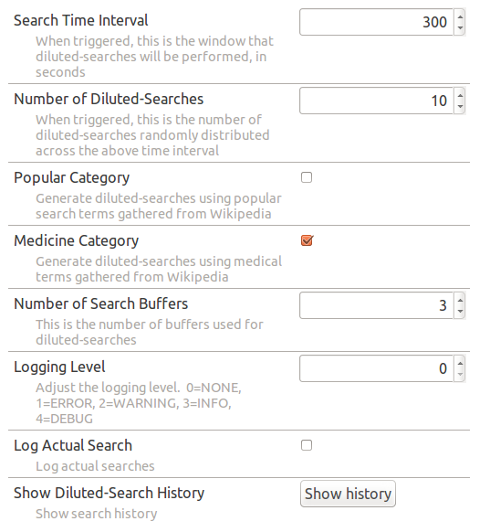
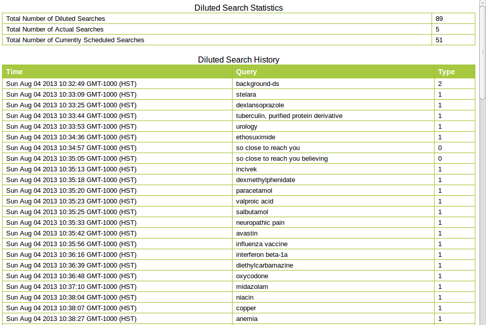

About DilutedSearch
------

###What is DilutedSearch?

DilutedSearch is a Firefox plugin that enhances the internet search privacy. It is well-known that search queries could be used to collect personal information such as habits, medical history, finances, sexual orientation, or political affiliation. DilutedSearch addresses this issue by interleaving automatically generated searches with real searches. By mixing many "dummy" searches with real searches, DilutedSearch makes it more difficult for the search engine to identify which searches are real and which searches are automatically generated. In other words, actual searches are diluted by "dummy" searches. The extension also disables click tracking, to prevent the search engine from knowing which links were clicked on.

###How does DilutedSearch work?

The plugin works by scheduling a number of "dummy" searches at random points over a certain amount of time. Additional "dummy" searches are added whenever a new real search is performed. The "dummy" searches are chosen based on contents from Wikipedia under different search categories. The search categories and many other settings are configurable by the user.   

###How do I use DilutedSearch?

DilutedSearch adds an item to Firefox's search toolbar called "Diluted Search".    Searching from this toolbar will also cause the plugin to perform a set number of diluted searches behind the scenes (see the section on configuration options for more detail).  The plugin will also work if you go to a search engine website (see note below) directly, and perform the search there.  However, there is a small issue that you should be aware of: certain search engines have an "instant search" feature that sends keystrokes to the server as you type.  THIS MUST BE DISABLED TO PROTECT YOUR PRIVACY, otherwise the search engine could simply look at which searches were preceded by sending individual keystrokes and pick out the real ones.  To do this on Google, for example, you must use the complete=0 option in the URL (the Diluted Search toolbar item does this automatically).  This means that in order to disable instant search on Google, you must go to www.google.com/search?complete=0  We HIGHLY RECOMMEND bookmarking this URL if you like to search off the main page instead of in the toolbar so that you don't need to type in every time.

NOTE: Currently, Google is the only supported search engine.  We hope to add support for other popular search engines as well in the future.

###What search categories are available?

Currently, there are two categories: Popular and Medicine.  The Popular category includes searches from mainstream, popular culture.  The Medicine category will perform dummy searches on medical topics.  This is particularly useful if, for example, one is searching for information on a specific medical condition (presumably one that affects oneself or one's family).  By "diluting" the search results by injecting searches for other medical conditions, it makes it more difficult to determine which condition(s) the real user wants information about.

###What configuration options are available?

The Preferences section can be reached by going to Tools->Add-ons->Extensions->Diluted Search->Preferences.  An example of the Preferences section is shown in
the image below:

The configuration options are:

* Search Time Interval: When a real search is performed, the plugin schedules a certain number of diluted searches, randomly distruted over a specified time interval.  This is that time interval.

* Number of Diluted Searches: This is the number of searches performed in the Search Time Interval, for each real search submitted.

* Categories: Check the box to perform diluted searches in the desired category.  If more than one box is checked, then the searches will be performed from all relevant categories.

* Number of Search Buffers: The Firefox plugin creates a number of "page workers", which are permanent, invisible pages.  These pages are used to perform the diluted searches, and they are used in a round-robin fashion to perform each successive search.  Unless you have a real reason to change this, it should be left at its default setting.

* Logging Level: Dynamic debugging level (for use by developers).  Levels available are 0 (NONE) through 4 (DEBUG).

* Log Actual Searches: If enabled, logs the contents of the Actual searches to the Show Diluted-Search History page.  If disabled (default), doesn't log the contents of Actual searches to the History page, but still logs how many Actual searches have been performed.

* Show Diluted-Search History: Brings up a page showing search history, which includes number of searches, search terms (both for real and diluted searches), and searches scheduled in the future.

   Note that there are several sections to the Show History page:
   * Total Number of Diluted Searches: The total number of "dummy" searches performed
   * Total Number of Actual Searches: The number of times the user has done a real search through the search engine
   * Total Number of Currently Scheduled Searches: The number of "dummy" searches scheduled, but not yet executed.  These searches are randomly distributed throughout the Search Time Interval when the user performs an Actual search.
   * Diluted Search History: Shows the time, the term searched for, and the search type.  0 is an Actual search (not logged by default, unless the Log Actual Search button is checked), 1 is a "dummy" search scheduled along with an Actual search, and 2 is a "dummy" search scheduled spontaneously (to prevent the search engine from being able to identify a real search, after a long idle period, as the first search performed after said idle period).

* Disable/Enable button: This can be used to disable or enable the plugin.  Also, disabling and re-enabling the plugin will reset the search counter.

###What if I get a captcha because too many searches have been submitted in too short a period of time?

Ah yes, the dreaded captcha.  Search providers don't like it when automated software submits searches, so if you submit too many searches in too short a time period, they'll often force you to do a captcha like the one shown above to prove you are human.

If you get these notifications often, it can give away which searches are real and which ones are not (the search that answers a captcha correctly is ALWAYS a real search).

While we believe that the default settings will not cause problems for most users in most cases, it is possible to reduce the number of diluted searches performed for each real search.  This should reduce the rate of searches being submitted below the threshold required to trigger the captcha.  To do this, go to the Diluted Search Preferences page (Tools->Add-Ons->Extensions->Diluted Search->Preferences), find the "Number of Diluted-Searches" box, and reduce the number of searches as desired.

###How should I configure Google for searching?
DilutedSearch automatically disables Google Instant to protect your privacy, however there is another way that your real searches can be revealed: if you click on the link to the second, third, etc, page of search results, this search can be identified as the real search.

If you routinely use search results past the first page, then go to www.google.com/preferences and set the number of search results per page to something large enough that you don't need ever click on the second page of results.